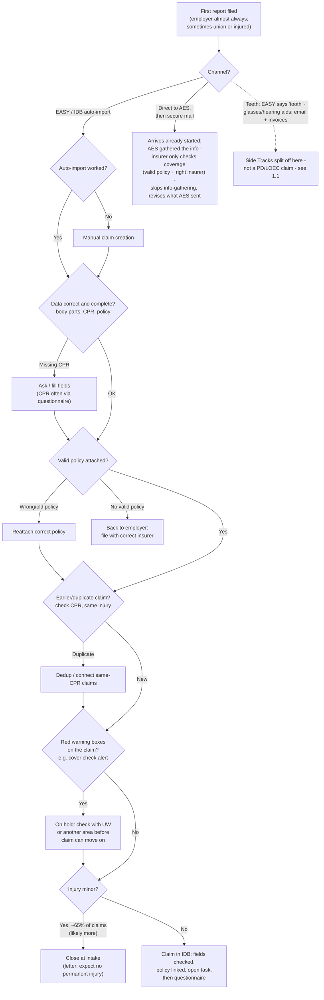
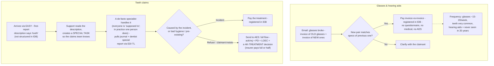
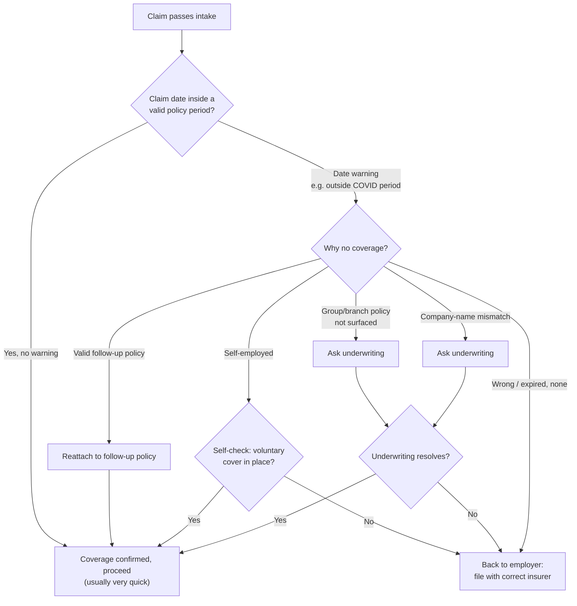

# Claims Workflow — Explained (FNOL & Coverage Check)

## Context

A Nordic specialty **workers' compensation** insurer, operating as an **MGA**
(Managing General Agent — it underwrites and handles claims on a carrier's
behalf, using delegated authority, but does **not** carry the insurance risk
itself; the carrier's balance sheet does, the MGA earns a fee/commission for
running underwriting and/or claims). A claims team of ~30 people processes
injury claims end to end.

The two diagrams below are the **happy path, top to bottom**, with exception
and rework branches splitting off wherever the real process deviates from the
ideal case.

> Note on the diagrams: the originals were shared as pasted images, which
> aren't files I can pull bytes from. I've redrawn both as Mermaid
> flowcharts below — this makes them version-controlled, diffable text
> instead of static pictures, which is generally the more useful artifact
> for a process-transformation project anyway (you can see exactly what
> changed between revisions in `git log`).

## Glossary

| Term | Meaning |
|---|---|
| **MGA** | Managing General Agent — underwrites/handles claims on behalf of a risk-carrying insurer without holding the risk itself. |
| **FNOL** | First Notice of Loss — the very first report that an incident happened; industry-standard term across all of P&C insurance, opens the claim file. |
| **EASY** | The national digital portal where employers (almost always), unions, or injured workers file the first report. ~50 first reports/day come through it. |
| **AES** | The statutory work-injury authority. It issues the **binding** legal decision on the case (this is a government body, separate from and superior to the insurer's own view). This strongly matches the real Danish authority *Arbejdsmarkedets Erhvervssikring* — worth confirming, but treat as informed inference rather than certainty. |
| **IDB** | The insurer's core claims system — the internal system of record where an accepted claim actually lives, gets fields checked, tasks opened, etc. |
| **CPR** | The national **person** register number (Danish-style civil registration ID) — a unique ID per resident, used to tie a claim to one specific injured person and to detect duplicate claims for the same person/injury. |
| **CVR** | The national **business** register number — identifies the employer company, used to match the claim to the right policy. |
| **PD** | Permanent Damage (assessment) — one of the two core rulings AES makes on a claim. |
| **LOEC** | Loss Of Earning Capacity — the other core AES ruling: the % reduction in the claimant's ability to earn income because of the injury, which drives ongoing wage-loss compensation. |
| **UW** | Underwriting — the team that owns policy terms/exceptions; gets pulled in when coverage isn't a clean yes/no. |
| **ack/rej** | AES's initial acknowledge-or-reject decision on whether the case is accepted as a covered work injury at all. |
| **EDI TL** | A named data-exchange integration used to pull a dentist's special report (only relevant to the teeth side-track — implementation-specific, not a general insurance term). |

## Diagram 1 — FNOL (First Notice of Loss)

**What it's doing:** turning a report of an injury into either (a) a closed,
no-further-action claim, or (b) a validated claim sitting correctly in IDB,
ready for the coverage check and full processing.

**Reading it step by step:**

1. **Intake channel splits three ways** the moment a report arrives:
   - The digital, structured path (**EASY → auto-import into IDB**) — the default, high-volume path.
   - A path where **AES got there first** — the authority already gathered the facts and sends the insurer a secure mail; the insurer's job shrinks to just confirming coverage, not re-collecting information.
   - A **side-track** for claim types that don't fit the standard structured shape at all (teeth, glasses, hearing aids) — these split off entirely into their own mini-process (Diagram 1.1) because they aren't PD/LOEC claims (i.e., they don't go through AES's disability/earning-capacity assessment at all).

2. **If auto-import breaks**, someone manually re-keys the claim — a pure rework/exception cost with no business-logic difference, just a manual labor step substituting for a failed integration.

3. **Data completeness gate**: body parts, CPR, policy info all need to be present. Missing CPR specifically triggers a questionnaire to the claimant — this is a recurring theme (three separate gates in this one diagram funnel back to "ask the claimant a question").

4. **Policy validity gate**: wrong/old policy is fixable in-house (reattach); genuinely no valid policy is a hard stop — claim gets bounced back to the employer to refile with whoever the correct insurer actually is. This insurer only wants claims it's actually on risk for.

5. **Duplicate detection**: uses CPR + same injury as the matching key — this is the practical use of that national person ID, functioning as a deduplication join key across claims.

6. **"Red warning boxes"** are an existing system-level flag (e.g., an automated cover-check alert) that forces a manual hold until underwriting or another team clears it — this is effectively a rudimentary rules-engine gate sitting inside a human workflow.

7. **The big fork at the end**: ~65% (stated as "likely more") of claims are simply minor and get closed right at intake with a templated letter — no AES involvement, no ongoing case. Everything else becomes a full claim living in IDB, headed into the coverage check and beyond. This 65% number is the single biggest volume signal in the whole diagram — most of the "process" only ever touches roughly a third of claims.

## Diagram 1.1 — Side Tracks (rare exception claim types)

**What it's doing:** handling claim types that never enter the PD/LOEC (disability/earning-loss) track at all — small, direct reimbursements instead.

**What stands out here:**

- **Glasses/hearing aids** are the simplest possible claim type in the whole
  process: it's literally "does the new invoice match the old prescription?"
  — if yes, pay it, no medical review, no AES, no questionnaire. It's
  effectively a two-invoice reconciliation problem, at real volume
  (15–20/week).
- **Teeth claims are a structural mismatch, not a hard case.** The portal
  (EASY) has no structured field for "tooth" — it only exists as free text
  inside the description, so the system can't route it automatically. A
  human has to *read* the text, recognize it's a dental claim, and manually
  create a task. It has then apparently calcified into **one person being
  the de-facto expert** by habit, not by design ("everyone is supposed to
  handle these; in practice they concentrate on her") — a classic single-
  point-of-failure / key-person-risk pattern that shows up when a process
  isn't formally owned.
- The teeth decision is a straightforward causation question (accident vs.
  pre-existing/poor hygiene), but if the claimant disputes a refusal, it
  escalates into the **full heavyweight AES process** (the same
  ack/rej + PD + LOEC machinery used for serious injury claims), plus one
  extra "treatment" ruling specific to dental (full or half cost coverage).
  So a claim that started as "my tooth chipped" can, on dispute, become as
  procedurally heavy as a real disability claim.

## Diagram 2 — Coverage Check

**What it's doing:** confirming the claim happened while a valid policy was
actually in force, before the insurer commits to processing it further.

**Reading it:**

- The **fast path is the default**: if the claim date sits cleanly inside a
  valid policy window, coverage is confirmed almost instantly — this is the
  no-friction case that presumably covers the large majority of claims that
  reach this stage.
- Every warning branches into a **"why no coverage?" diagnosis**, and each
  cause has a different fix:
  - A **follow-up policy** exists → just reattach to it (self-service fix,
    no escalation needed).
  - **Self-employed** claimants aren't automatically covered the same way
    employees are, so there's a separate self-check for whether they opted
    into voluntary cover.
  - **Group/branch policies not surfacing**, or a **company-name mismatch**
    (e.g. the employer on the claim doesn't textually match the policyholder
    name in the system) both require **underwriting** to manually
    investigate and resolve — these are data/matching problems, not real
    coverage gaps, but the system can't resolve them on its own.
  - **Genuinely wrong, expired, or no policy** → straight back to the
    employer, no further insurer involvement.
- Notice the process treats "the data doesn't match" (company-name mismatch,
  branch policy not surfaced) as functionally identical in *routing* to "we
  need a human to figure out why," even though these read as fixable
  **matching/lookup problems** rather than genuine underwriting judgment
  calls — worth flagging as the two coverage-escalation reasons that look
  most like a data-quality/entity-resolution issue rather than a real
  coverage question.

## A few things worth carrying forward

- **~65% of all claims** never leave the FNOL stage as anything more than a
  "you're fine" letter — this is the single largest volume bucket in the
  entire process.
- **CPR and CVR numbers are the two join keys** the whole process actually
  runs on: CPR ties claims to a person (dedup, questionnaire targeting),
  CVR ties claims to an employer/policy (coverage matching).
- **The teeth side-track exists only because EASY has no structured field
  for it** — a data-capture gap at the front door creates a manual-routing
  problem three steps later, and has produced an informal single point of
  failure (one person as the de-facto specialist).
- **"Ask underwriting" appears twice in Diagram 2 for what look like data-matching problems**, not underwriting judgment calls — group/branch policy not surfacing, and company-name mismatches.
- Every gate that says "missing CPR," "no valid policy," "duplicate claim,"
  or "coverage warning" is, structurally, the same shape: **a lookup/match
  against a system of record that sometimes fails**, requiring either a
  human fix (reattach, dedup) or a bounce (back to employer).
